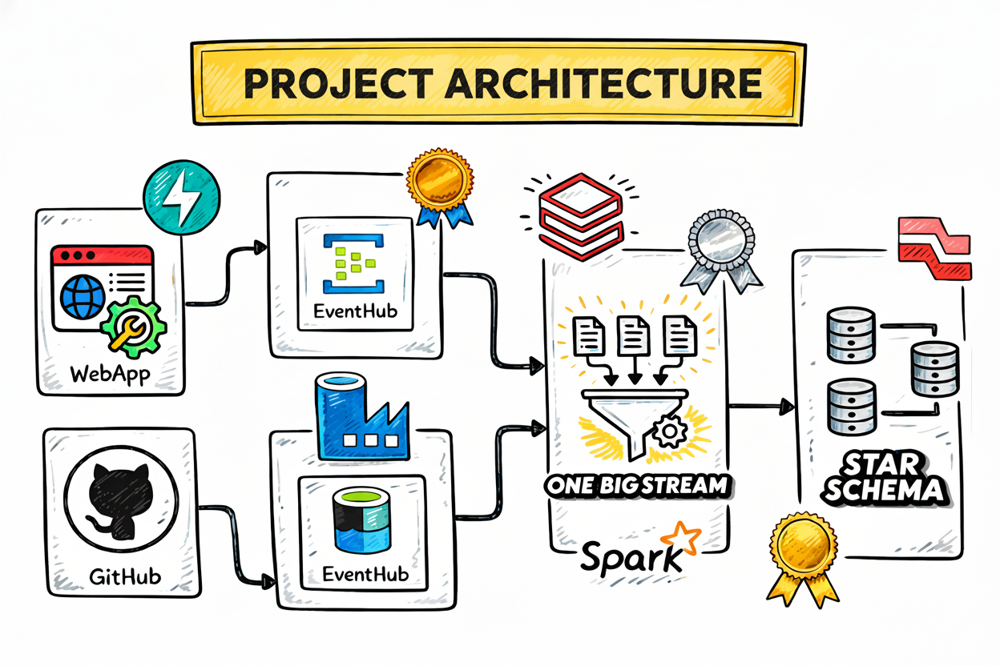

# 🚖 Uber Real-Time Data Engineering Pipeline on Azure

An **end-to-end streaming data engineering pipeline** built on **Microsoft Azure** that processes **real-time ride events and batch datasets** to produce an **analytics-ready Star Schema model**.

This project simulates an **Uber-like ride booking platform** where ride events are streamed through **Azure Event Hub**, processed using **Azure Databricks Structured Streaming**, and transformed into a **Lakehouse architecture (Bronze → Silver → Gold)** for analytical workloads.

The pipeline demonstrates modern **cloud data engineering practices**, including streaming ingestion, batch pipelines, metadata-driven processing, and dimensional modeling.

---

# 📌 Project Highlights

* Real-time event ingestion using **Azure Event Hub**
* Batch data ingestion using **Azure Data Factory**
* Data processing using **PySpark on Azure Databricks**
* Implementation of **Medallion Architecture (Bronze / Silver / Gold)**
* **One Big Table (OBT)** design for integrated datasets
* **Slowly Changing Dimensions (SCD Type 2)** implementation
* **Star Schema dimensional modeling** for analytics
* Scalable **Lakehouse architecture on Azure**

---

# 🏗️ Architecture Overview

The pipeline follows a **Lakehouse Architecture** built using Azure services.

## Pipeline Flow

```
Event Producer
      │
      ▼
Azure Event Hub
      │
      ▼
Azure Data Lake Storage (Bronze Layer)
      │
      ▼
Azure Databricks (Streaming + Batch Processing)
      │
      ▼
Silver Layer (One Big Table - OBT)
      │
      ▼
Gold Layer (Star Schema for Analytics)
```

### System Architecture



---

# ⚙️ Tech Stack

### Programming

* Python
* PySpark
* SQL

### Azure Services

* Azure Event Hub
* Azure Data Factory
* Azure Data Lake Storage Gen2
* Azure Databricks

### Data Engineering Concepts

* Real-Time Data Streaming
* Batch + Streaming Pipelines
* Medallion Architecture
* Metadata-Driven Pipelines
* Slowly Changing Dimensions (SCD Type 2)
* One Big Table (OBT)
* Star Schema Data Modeling
* Lakehouse Architecture

---

# ☁️ Azure Resource Setup

All Azure services required for the pipeline are deployed within a dedicated **Azure Resource Group**.

The resource group includes:

* Azure Event Hub
* Azure Data Factory
* Azure Databricks
* Azure Data Lake Storage

### Azure Resource Group


---

# 📡 Real-Time Streaming Pipeline (Azure Event Hub)

Ride booking events are simulated using **Python producer scripts** located in:

```
Event_Producer_Scripts/
```

These scripts generate ride events and send them to **Azure Event Hub**, which acts as the **real-time ingestion layer**.

Event Hub allows scalable ingestion of streaming events before downstream processing.

### Event Hub Streaming


---

# 🔄 Batch Data Ingestion (Azure Data Factory)

Static reference datasets required for the pipeline are ingested using **Azure Data Factory**.

These datasets include:

* Driver information
* User information
* Location mapping data

The ADF pipeline retrieves these datasets from GitHub and loads them into the **Bronze layer of Azure Data Lake Storage**.

### Azure Data Factory Pipeline


Pipeline definitions are available in:

```
ADF_Pipeline/
```

---

# ⚡ Data Processing using Azure Databricks

All transformations and processing logic are implemented using **Azure Databricks with PySpark**.

Processing steps include:

* Streaming ingestion from Azure Event Hub
* Parsing incoming JSON ride events
* Data cleansing and validation
* Enriching streaming events using reference datasets
* Preparing datasets for analytical modeling

### Databricks Processing Pipeline


Transformation notebooks are stored inside:

```
Code_Files/
```

---

# 🧩 Silver Layer – One Big Table (OBT)

The **Silver layer** integrates both streaming and batch datasets into a unified **One Big Table (OBT)**.

The OBT is created by combining:

* Streaming ride events from **Azure Event Hub**
* Static reference datasets loaded via **Azure Data Factory**

Transformations performed include:

* JSON parsing
* Data cleansing
* Joining ride events with driver, user, and location datasets
* Standardizing schema and data types

The **OBT acts as a centralized analytical dataset** that contains enriched ride information.

This dataset is then used to generate the **Gold layer dimensional model**.

---

# 🔁 Slowly Changing Dimensions (SCD Type 2)

The pipeline implements **Slowly Changing Dimension Type 2** to track historical changes in dimension tables.

For example, **driver information** changes are captured while maintaining history.

Key columns used:

```
effective_start_date
effective_end_date
is_current_record
```

This approach ensures that both **historical and current records are preserved**.

### SCD Type 2 Implementation


---

# 🪙 Gold Layer – Star Schema Model

The **Gold layer** contains analytics-ready tables designed using **Star Schema**.

This layer is optimized for BI reporting and analytical queries.

Typical tables include:

### Fact Table

```
fact_rides
```

### Dimension Tables

```
dim_driver
dim_user
dim_location
dim_date
```

These tables can be directly used by **BI tools such as Power BI**.

### Medallion Architecture Flow


---

# ⭐ Key Data Engineering Concepts Demonstrated

This project demonstrates several production-grade data engineering practices:

* Real-time streaming ingestion
* Hybrid batch + streaming pipelines
* Lakehouse architecture on Azure
* Metadata-driven ETL pipelines
* Medallion architecture (Bronze / Silver / Gold)
* One Big Table (OBT) design
* Slowly Changing Dimensions (Type 2)
* Star schema dimensional modeling
* Scalable cloud-based data pipelines

---

# 📂 Repository Structure

```text
Uber_Data_Engineer_Project
│
├── ADF_Pipeline
│
├── Architecture
│   └── Architecture.png
│
├── Code_Files
│   ├── Bronze_Layer
│   ├── Silver_Layer
│   ├── Gold_Layer
│   └── Utilities
│
├── Data
│   ├── bulk_rides.json
│   ├── map_cancellation_reasons.json
│   ├── map_cities.json
│   ├── map_payment_methods.json
│   ├── map_ride_statuses.json
│   ├── map_vehicle_makes.json
│   └── map_vehicle_types.json
│
├── Event_Producer_Scripts
│
├── meta_data_configs
│
├── lk-adf-uberproject-dev
│
├── Screenshots
│
└── README.md
```

---

# 🚀 Future Improvements

Potential enhancements for this project:

* Build **Power BI dashboards** using Gold layer tables
* Add **data quality validation checks**
* Implement **CI/CD pipelines with Azure DevOps**
* Add **monitoring and alerting for pipelines**
* Implement **data lineage tracking**

---

# 👩‍💻 Author

Hi, I’m **Lavanya** 👋
I’m a Data Analyst and aspiring **Data Engineer** passionate about building data-driven solutions.
I enjoy working with SQL, data warehousing, and analytics to transform raw data into meaningful insights.
This project is part of my portfolio to demonstrate hands-on experience in **data engineering and analytics**.

## 🔗 Connect with Me
🔗 **[LinkedIn Profile](https://www.linkedin.com/in/lavanya-lk)**  
📧 **Email:** lavanya347@gmail.com  
Lavanya K  

Data Analyst | Aspiring Data Engineer

---
